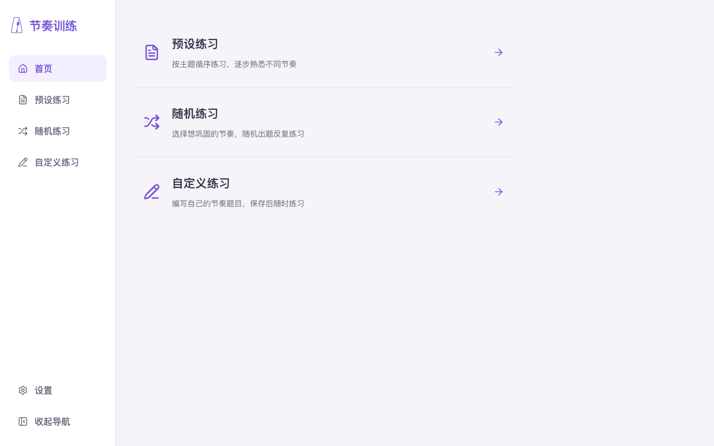
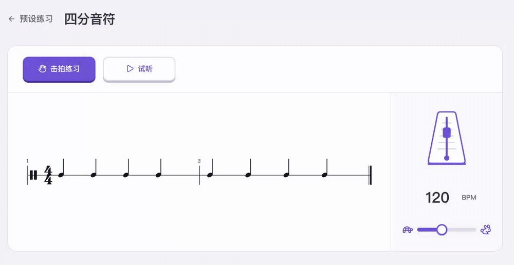
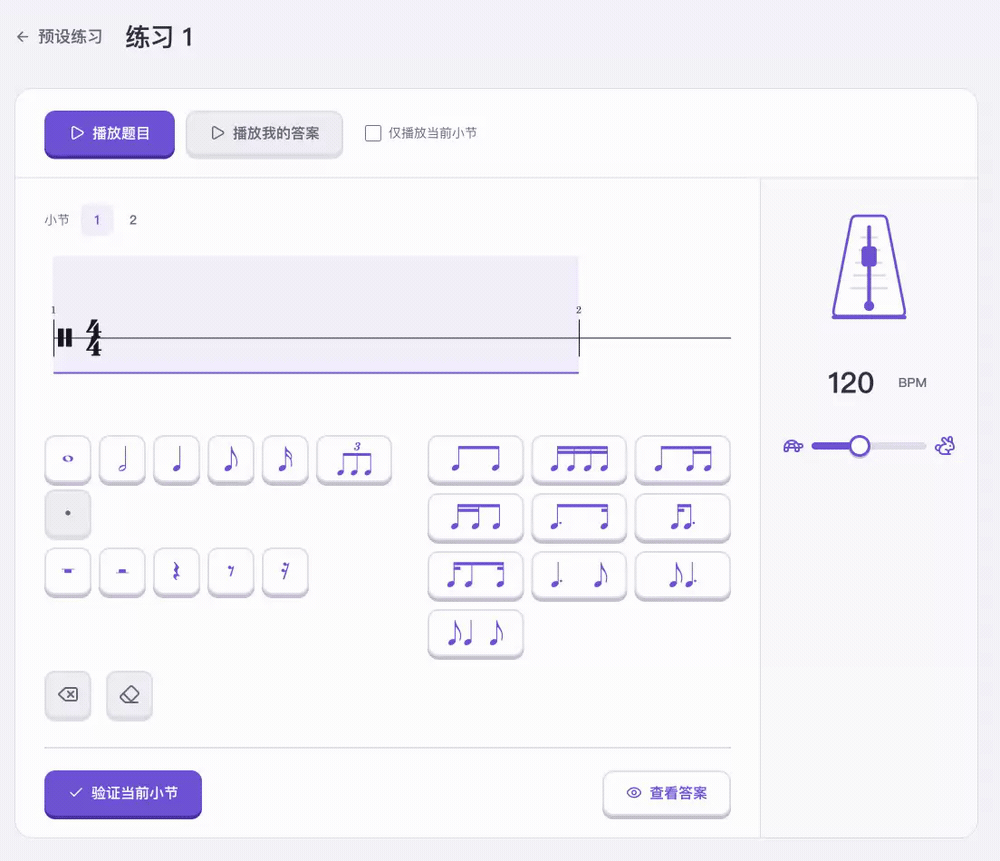

# 节奏训练

## 核心功能

### 总览

一个网页版节奏训练工具，目前支持击拍练习、节奏听写两种模式，支持预设练习、随机练习、自定义练习。



### 击拍练习

跟随谱面按空格键击拍，查看每次击拍的准确度与整轮结果。



### 节奏听写

聆听题目，输入音符与休止符，逐小节验证答案。



_动图仅演示操作，不含声音。_

## 技术栈

- **前端界面**：React、TypeScript、Vite。
- **谱面渲染**：VexFlow。
- **音频与节拍调度**：Web Audio API。
- **后端接口**：Python、FastAPI。
- **数据存储**：SQLite、SQLAlchemy；Alembic 管理数据库迁移。
- **部署**：Docker Compose、Nginx。

## 快速启动（Docker）

```sh
git clone https://github.com/Emmet-Ray/a-rhythm-trainer.git
cd a-rhythm-trainer
docker compose up
```

打开 <http://localhost:8080>访问网页内容

## 计划开发内容

todo list
