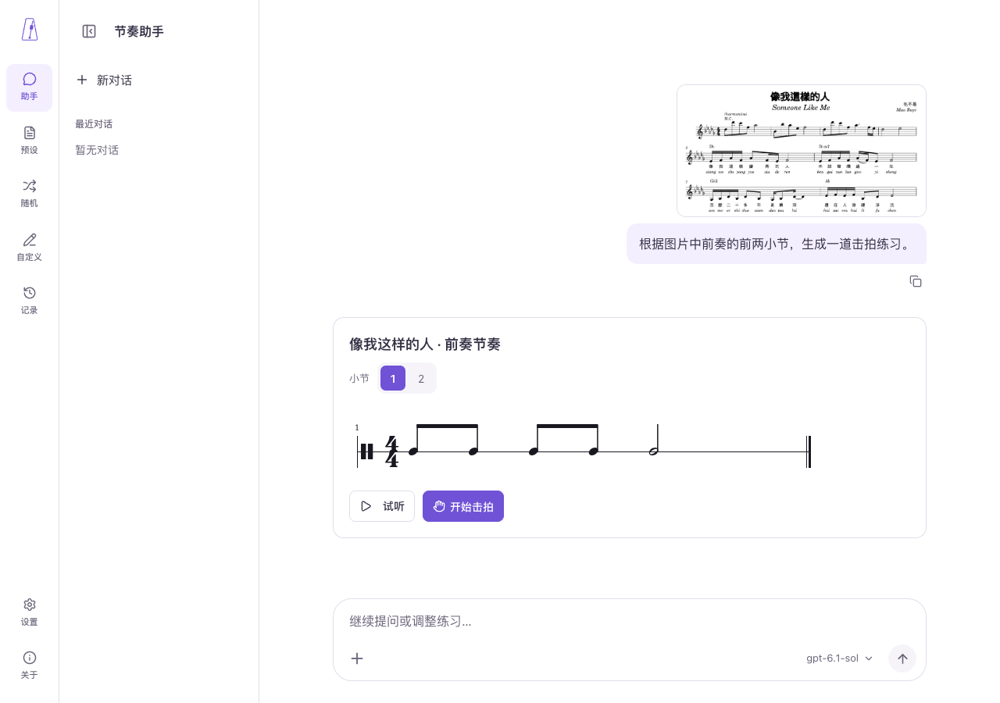
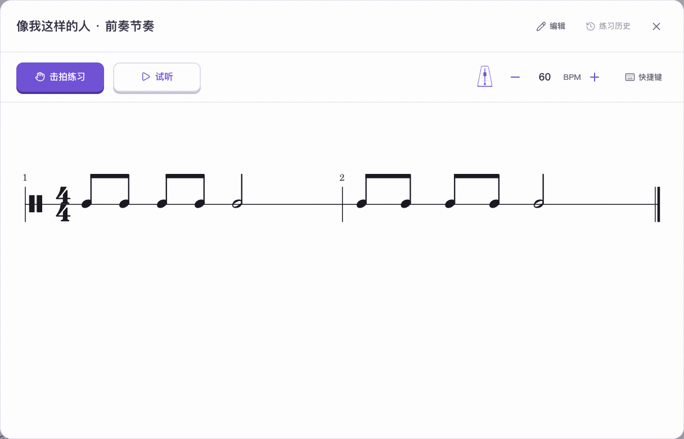
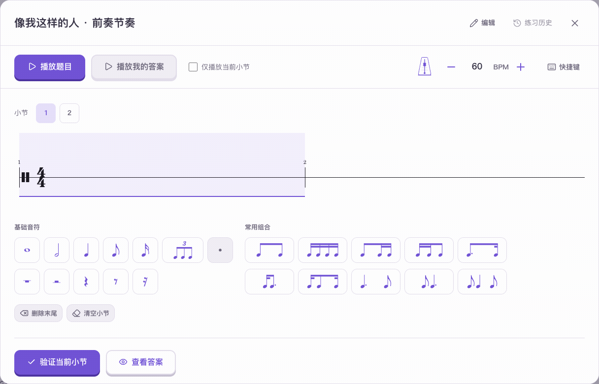

# 节奏训练

## 核心功能

### 总览

一个节奏训练工具，目前支持击拍练习、节奏听写两种模式，支持预设练习、随机练习、自定义练习，以及 AI 对话出题与节奏讲解。



### 击拍练习

跟随谱面按空格键击拍，查看每次击拍的准确度与整轮结果。



### 节奏听写

聆听题目，输入音符与休止符，逐小节验证答案。



_动图仅演示操作，不含声音。_

## 技术栈

- **前端**：React、TypeScript、Vite；React Router（路由）、Lucide（图标）、react-markdown（Markdown 渲染）、VexFlow（谱面渲染）、Web Audio API（音频与节拍调度）；AI SDK UI（助手流式消息）
- **后端**：Python、FastAPI；SQLite、SQLAlchemy、Alembic（数据存储与迁移）；Pydantic AI（模型接入与工具调用）、OpenAI Python SDK（DeepSeek Responses）
- **部署**：Docker、Nginx

## 快速启动（Docker）

1. 下载项目并复制配置文件：

   ```sh
   git clone https://github.com/Emmet-Ray/a-rhythm-trainer.git
   cd a-rhythm-trainer
   cp .env.example .env
   ```

2. 编辑根目录 `.env`，填写 DeepSeek API Key 使用AI助手功能（可选）

   ```dotenv
   AI_PROVIDER=deepseek
   AI_MODEL=deepseek-flash
   AI_API_KEY=你的APIKey
   ```

3. 启动：

   ```sh
   docker compose up -d --build
   ```

打开 <http://localhost:8080> 即可使用。

## TODO

### 新增功能

- [ ] 击拍练习支持调整开始小节（现在都是默认从开头开始）
- [ ] 自定义练习题目：支持文件导入
- [ ] 增加音色选择、节拍器音量与重音设置
- [ ] 支持输入与音频输出延迟校准
- [ ] AI 节奏助手
  - [x] AI对话助手，支持生成击拍练习、听写练习并开始练习
  - [x] 编辑保存 AI 生成的题目
  - [x] 页面上下文：练习与编辑、题目目录、生成设置、练习记录和设置页
  - [x] 会话持久化
  - [ ] 图片输入
  - [ ] 搜索功能
- [ ] 几何节奏游戏模式

### 功能改进

- [ ] 调整预设题目的内容安排
- [ ] 调整随机出题策略
- [ ] 练习记录
  - [x] 练习记录列表与详情分页，每页 10 条
  - [x] 正式击拍开始后主动停止记为未通过，准备和预备拍阶段停止不记录
  - [ ] 完善练习记录概览
    - [x] 数字摘要与时间／模式筛选联动
    - [ ] 确定展示内容
    - [ ] 确定图表或其他合适的展示形式
- [ ] 支持更多拍号与节奏记谱方式

### 界面与交互

- [ ] 为预设题目提供不同的展示方式（目前都是文字）
- [ ] 完善网页动效与交互动效
  - 菜单展开与内容折叠
  - 页面转场
- [ ] 支持调整侧栏宽度
  - 调整其他页面右侧助手展开时的宽度
  - 考虑其他区域是否也需要支持调整宽度或高度
- [ ] 检查并统一界面与交互的一致性

### 文档维护

- [ ] 更新 README 中的界面截图与操作演示 GIF
- [ ] 更新功能介绍与使用说明，使其与当前实现一致
- [ ] 补充 AI 助手出题、练习与编辑保存的操作演示
- [ ] 同步前后端文档中的配置、运行与开发说明
